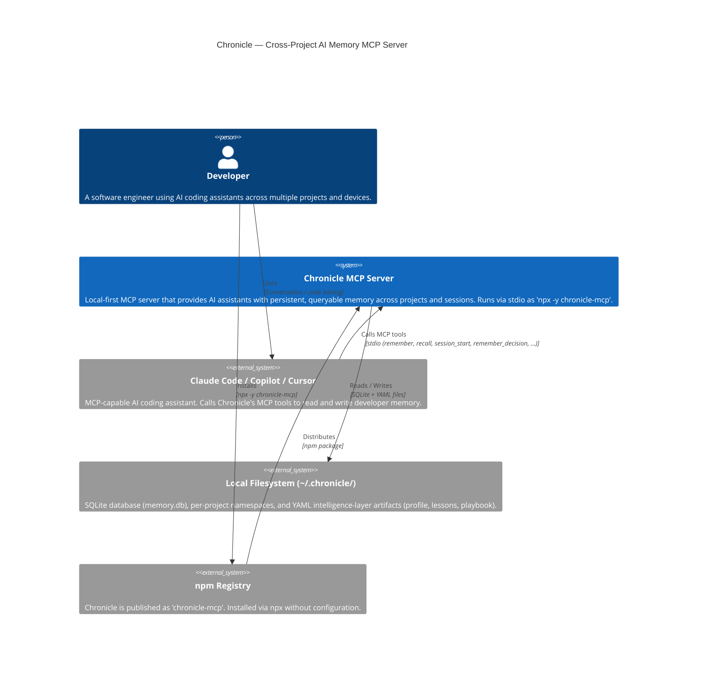
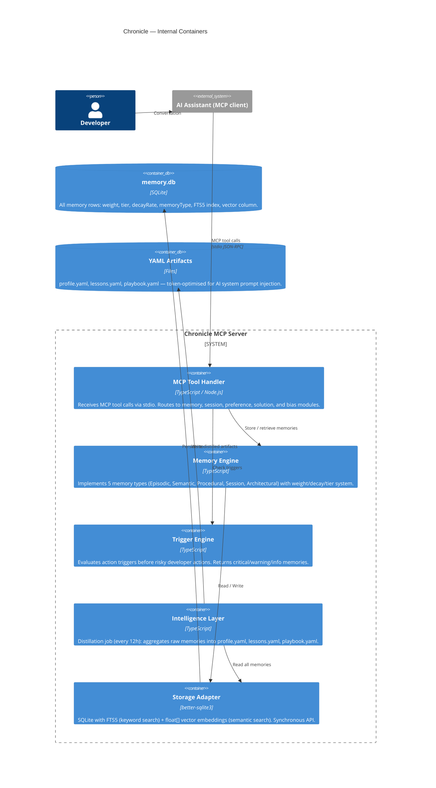

# C4 Context Diagram — Chronicle

## System Context

## Container Diagram

## Key Design Constraints

| Constraint | Value | Rationale |
|------------|-------|-----------|
| Cold start | < 200ms | MCP server is spawned on each AI session start; latency is visible to the user |
| `recall()` response | < 50ms (10k memories) | Synchronous path; blocking AI assistant response |
| Background decay job | < 500ms (50k memories) | Runs once daily; must not block tool calls |
| No cloud dependency | Fully local | Privacy-first; no telemetry; works offline |
| Single binary | npx install | Zero configuration; works in any MCP client |
